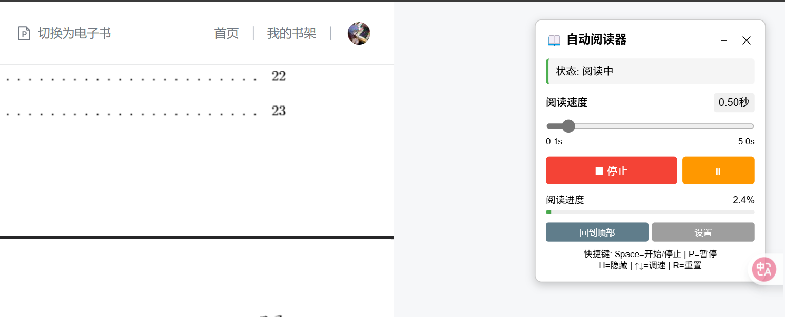

# WxRead-AutoReader-Tampermonkey

**🚀 高性能微信读书自动阅读器**

**智能翻页 | 断点续读 | 无级调速 | 一键安装**

---

## ✨ 主要功能

- 📖 **智能翻页** - 自动检测章节结束并翻页
- 🎚️ **滑动条调速** - 0.1秒到5秒无级调速
- 🔄 **断点续读** - 从当前位置开始，不重复阅读  
- ⏯️ **暂停恢复** - 随时暂停，保持进度
- 🎯 **进度跳转** - 点击进度条直接跳转
- ⌨️ **快捷键** - 完整的键盘控制
- 🔔 **智能通知** - 读完整本书才弹框提醒

## 🛠️ 一键安装

1. **安装 Tampermonkey**
   
   
   
   

2. **安装脚本**

   **🚀 [点击这里安装](https://raw.githubusercontent.com/Kaguranotamashii/WxRead-AutoReader-Tampermonkey/main/WxRead-AutoReader-Tampermonkey.js)**

3. **开始使用**

   访问微信读书 → 打开任意书籍 → 右上角出现控制面板

## 🎮 界面展示

## 📖 使用说明

### 基础操作

1. **开始阅读** - 点击"▶ 开始阅读"按钮
2. **调节速度** - 拖动滑动条调整阅读速度  
3. **暂停恢复** - 点击"⏸"按钮暂停/恢复
4. **进度跳转** - 点击进度条任意位置跳转

### 设置选项

- **断点续读** - 从当前位置开始阅读
- **浏览器通知** - 控制是否显示通知

## ⌨️ 快捷键

| 按键   | 功能      | 说明         |
|--------|-----------|--------------|
| `空格` | 开始/停止 | 主控制键     |
| `P`    | 暂停/恢复 | 保持进度暂停 |
| `H`    | 显示/隐藏 | 面板开关     |
| `R`    | 回到顶部  | 重置位置     |
| `↑↓`   | 调节速度  | 微调速度     |
| `1-4`  | 快速设置  | 速度档位     |

## 🔥 核心亮点

### 断点续读
告别从头开始，智能记录当前位置，刷新页面后从断点继续阅读。

### 精确调速  
0.1秒到5.0秒无级调速，滑动条实时显示具体秒数，如"1.50秒"。

### 智能通知
只有读完整本书才会弹框庆祝，章节结束等只记录日志，不打扰阅读。

### 高性能优化
DOM缓存、节流优化、内存管理，运行更流畅，占用更少资源。

## 🐛 问题反馈

遇到问题？欢迎反馈：

- [📝 提交 Bug](https://github.com/Kaguranotamashii/WxRead-AutoReader-Tampermonkey/issues)
- [💡 功能建议](https://github.com/Kaguranotamashii/WxRead-AutoReader-Tampermonkey/discussions)

## 📄 许可证

[MIT License](LICENSE) - 自由使用和修改

---

**⭐ 如果有帮助，请给个 Star 支持！**

Made with ❤️ by [Kaguranotamashii](https://github.com/Kaguranotamashii)

